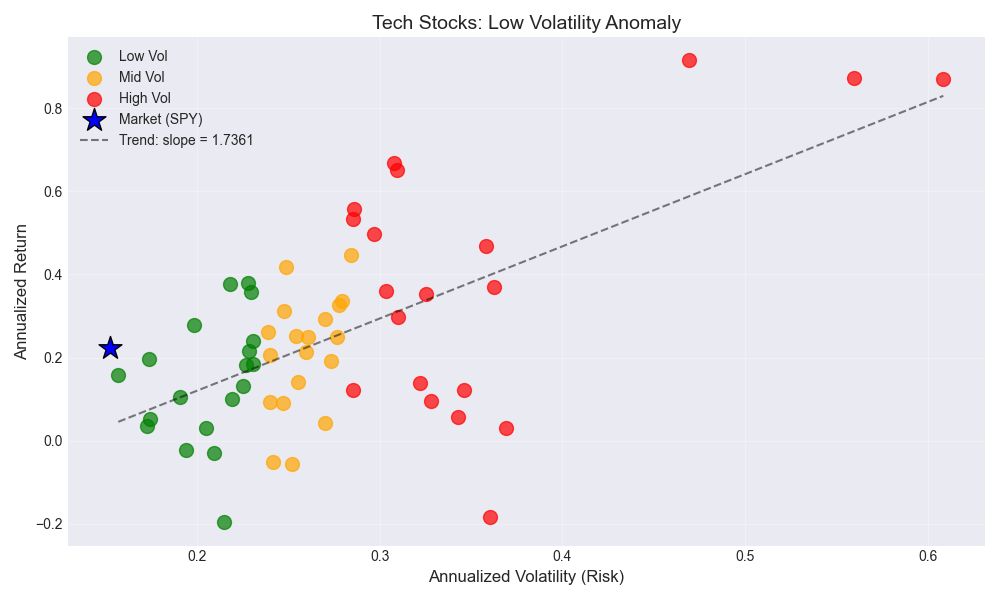
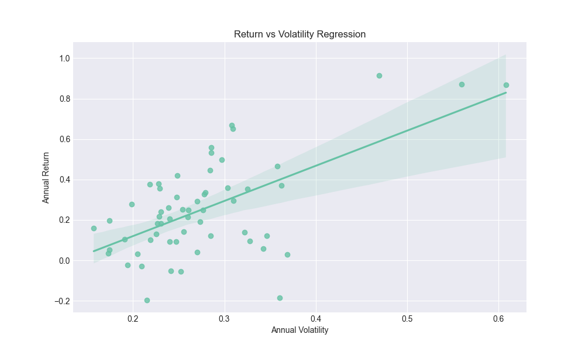
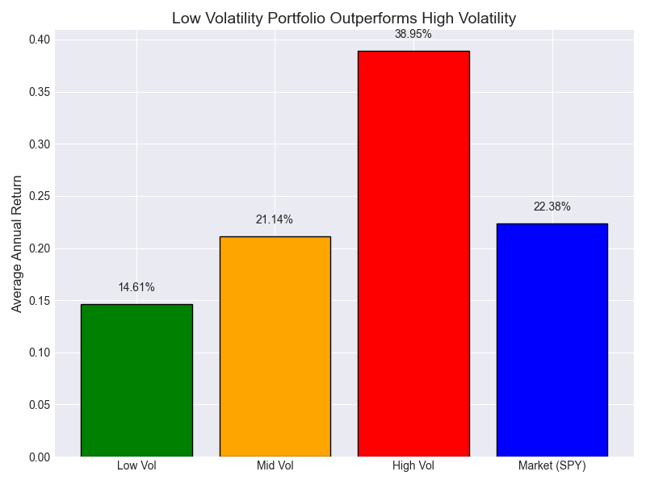

# quant-risk-return-analysis
Quantitative analysis of the risk-return relationship in U.S. equities using Python, volatility measures and OLS regression.
# US Stock Risk-Return Analysis

## Project Overview

This project investigates the relationship between risk and return in the US equity market using historical stock data from multiple sectors.

The objective is to test whether higher-risk stocks generate higher returns and evaluate portfolio performance using volatility, and regression analysis.

---

## Research Question

Does the traditional risk-return tradeoff hold in the US stock market?

---

## Dataset

### Sectors Included

Technology
Financials
Healthcare
Energy
Consumer
Industry
Telecom
Real estate

### Benchmark

S&P 500

### Data Source

Yahoo Finance API using yfinance

---

## Methodology

### Step 1: Data Collection

Historical stock prices downloaded using yfinance.

### Step 2: Return Calculation

Daily returns calculated using:

Daily Return = (P_t - P_(t-1))/P_(t-1)

### Step 3: Annualized Metrics

Annual Return:

Annual Return = Mean Daily Return × 252

Annual Volatility:

Annual Volatility = Standard Deviation × √252

### Step 4: Correlation Analysis

Pearson Correlation between volatility and returns.

### Step 5: Regression Analysis

OLS Regression Model:

Return = α + β(Volatility) + ε

### Step 6: Portfolio Formation

Stocks classified into:

- Low Volatility
- Medium Volatility
- High Volatility

---

## Technologies Used

- Python
- Pandas
- NumPy
- Matplotlib
- Seaborn
- SciPy
- Statsmodels
- yfinance

---

## Results

### Correlation Analysis

The Pearson correlation coefficient between annualized volatility and annualized returns was **0.6285**, indicating a moderately strong positive relationship between risk and return. Stocks with higher volatility generally produced higher returns during the sample period.

### Regression Results

The estimated OLS regression equation was:

Return = -0.2489 + 1.7949 × Volatility

The coefficient on volatility was positive and statistically significant (**p < 0.001**), suggesting that volatility had a meaningful impact on stock returns.

The model produced an **R² value of 0.395**, indicating that approximately **39.5%** of the variation in stock returns can be explained by differences in volatility.

### Portfolio Performance

| Portfolio         | Average Annual Return |
| ----------------- | --------------------- |
| Low Volatility    | 12.93%                |
| Medium Volatility | 20.73%                |
| High Volatility   | 40.64%                |
| SPY Benchmark     | 22.38%                |

The high-volatility portfolio generated the highest average return, outperforming both the medium-volatility portfolio and the benchmark market portfolio.

### Sharpe Ratio Analysis

The Sharpe Ratio analysis showed differences in risk-adjusted performance across portfolios. While high-volatility stocks generated superior raw returns, risk-adjusted performance varied across portfolio groups, highlighting the importance of considering both return and risk when making investment decisions.

### Visualizations

1. Risk vs Return / Low Volatility Anomaly Graph
Purpose: Visual comparison of low-, medium-, and high-volatility stocks.

Key Finding:
High-volatility stocks occupy the upper-right region of the graph and generally generated higher returns than low-volatility stocks.

2. Regression Graph

Purpose: Tests the relationship between risk and return.

Key Finding:
The regression line has a positive slope, indicating that stocks with higher volatility generally produced higher returns.

3. Portfolio Comparison Bar Chart

Purpose: Compares portfolio performance.

Key Finding:
The high-volatility portfolio achieved the highest average annual return (38.95%), outperforming both the market benchmark (22.38%) and the low-volatility portfolio (14.61%).
---

## Economic Interpretation

 ** Risk-Return Relationship

The empirical results indicate a positive relationship between risk and return in the U.S. equity market. The Pearson correlation coefficient of 0.6285 suggests a moderately strong positive association between annualized volatility and annualized returns. Stocks exhibiting greater price fluctuations generally generated higher returns during the sample period.

This relationship is further supported by the OLS regression results. The estimated model,

Return=−0.2489+1.7949(Volatility)

produced a positive and statistically significant volatility coefficient (p < 0.001), indicating that investors were rewarded for assuming additional risk. These findings are consistent with the traditional risk-return tradeoff proposed by modern financial theory.

**Portfolio Performance

Portfolio analysis provides additional evidence supporting the risk-return relationship. The low-volatility portfolio generated an average annual return of 12.93%, while the medium-volatility portfolio returned 20.73%. The high-volatility portfolio achieved the highest average annual return of 40.64%, outperforming both the medium-volatility portfolio and the market benchmark (SPY: 22.38%).

These results suggest that investors willing to tolerate greater uncertainty were compensated with higher returns during the sample period.

**Low Volatility Anomaly

One objective of this study was to examine the existence of the Low Volatility Anomaly, which proposes that lower-risk stocks can generate returns comparable to or greater than those of riskier assets. The findings provide little support for this hypothesis. Instead, high-volatility stocks substantially outperformed low-volatility stocks, indicating that the conventional positive relationship between risk and return dominated during the period analyzed.

**Explanatory Power of Volatility

The regression model produced an R² value of 0.395, implying that approximately 39.5% of the variation in stock returns can be explained by differences in volatility.

Although this highlights the importance of risk as a determinant of returns, it also indicates that volatility alone cannot fully explain stock performance. Other factors, including firm-specific characteristics, sector composition, macroeconomic conditions, technological developments, and investor sentiment, are likely to play significant roles in determining returns.

**Market Conditions and Theoretical Implications

The strong performance of high-volatility stocks may partially reflect market conditions during the sample period. Strong economic recovery, technological innovation, and growth-oriented investment opportunities likely benefited companies with higher growth expectations and greater price volatility.

Overall, the findings are broadly consistent with traditional asset pricing theories such as the Capital Asset Pricing Model (CAPM), which predicts that investors require higher expected returns as compensation for bearing greater risk. While the results do not prove market efficiency, they are consistent with the conventional view that risk was rewarded in the market during the sample period.

**Conclusion

The analysis demonstrates a positive and statistically significant relationship between volatility and stock returns. High-volatility portfolios generated substantially higher returns than low-volatility portfolios, providing support for the traditional risk-return tradeoff and little evidence for the Low Volatility Anomaly within the selected sample.

However, the moderate explanatory power of the regression model suggests that volatility is only one of several factors influencing stock returns. Future research incorporating longer sample periods and multifactor asset pricing models may provide a more comprehensive understanding of return determinants.

---

## Future Improvements

- CAPM Beta Analysis
- Fama-French Factors
- Sector-Wise Comparison
- Portfolio Optimization
- Machine Learning Return Prediction

---

## Author

Himanshu Mishra

Economics Undergraduate | Aspiring Consultant
